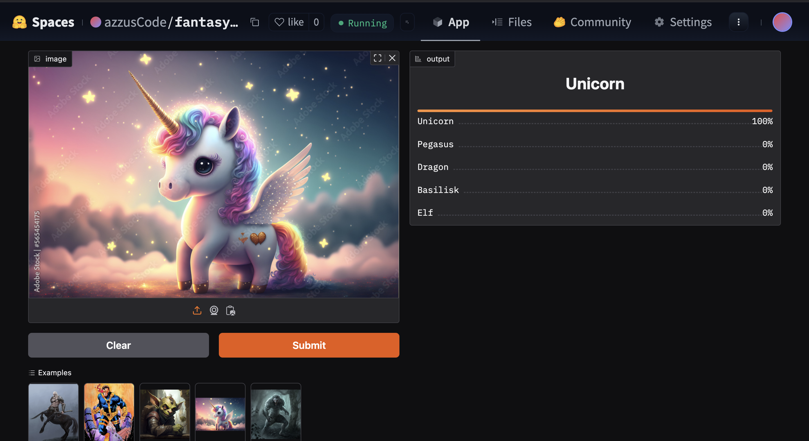

# Fantasy Creatures Classifier  

An image classification project that identifies 30 different types of fantasy creatures using deep learning. This model is trained using FastAI's vision library and is deployed on Hugging Face Spaces using Gradio.  

## Fantasy Creatures Categories  
The model classifies the following 30 types of fantasy creatures:  
1. Angel  
2. Basilisk  
3. Centaur  
4. Chimera  
5. Cyclops  
6. Demon  
7. Dragon  
8. Dwarf  
9. Elf  
10. Fairy  
11. Fire Elemental  
12. Genie  
13. Ghost  
14. Goblin  
15. Golem  
16. Griffin  
17. Hydra  
18. Kraken  
19. Lich  
20. Mermaid  
21. Minotaur  
22. Orc  
23. Pegasus  
24. Phoenix  
25. Unicorn  
26. Water Elemental  
27. Werewolf  
28. Wizard  
29. Wraith  
30. Zombie  

## Overview  
This project utilizes FastAI's powerful vision library to train a deep learning model capable of classifying images into 30 different fantasy creature categories. Images were gathered using DuckDuckGo image search, ensuring a diverse and comprehensive dataset.  

## Model Training  
- **Framework:** FastAI Vision  
- **Dataset:** Images collected using DuckDuckGo  
- **Classes:** 30 fantasy creatures (listed above)  
- **Model Architecture:** ResNet (transfer learning with fine-tuning)  

## Deployment  
The model is deployed on two platforms:  
1. **Hugging Face Spaces:** Using Gradio for an interactive interface.  
   - [Hugging Face Demo](https://huggingface.co/spaces/azzusCode/fantasy-creatures-classifier)  
2. **GitHub Pages:** For static site hosting.  
   - [GitHub Pages Demo](https://azzuscode.github.io/Fantasy-Creatures-Classifier/)  

## Screenshot  


## How to Use  
1. Visit the GitHub Pages/Hugging Face Spaces link.  
2. Upload an image of any fantasy creature.  
3. The model will predict and display the type of creature.  

## Installation and Local Setup  
To run this project locally, follow the steps below:  
1. Clone the repository:  
   ```bash
   git clone https://github.com/azzusCode/Fantasy-Creatures-Classifier.git
   ```  
2. Install dependencies:  
   ```bash
   pip install fastai gradio duckduckgo-search
   ```  
3. Run the Gradio app:  
   ```bash
   python app.py
   ```  

## Acknowledgments  
- [FastAI](https://www.fast.ai/) for the powerful deep learning framework.  
- [Hugging Face Spaces](https://huggingface.co/spaces) for easy deployment.  
- [DuckDuckGo](https://duckduckgo.com/) for image sourcing.  
- [JustGoodThemes](https://justgoodthemes.com/) for the GitHub Pages theme.  

## Future Improvements  
- Enhance model accuracy with more data augmentation.  
- Expand the dataset for better generalization.  
- Add more creature categories.  

## License  
This project is licensed under the MIT License.  

---

You can now add this to your GitHub repository. If you need any more modifications, let me know at [LinkedIn](https://www.linkedin.com/in/abidul-mohaimin/)!